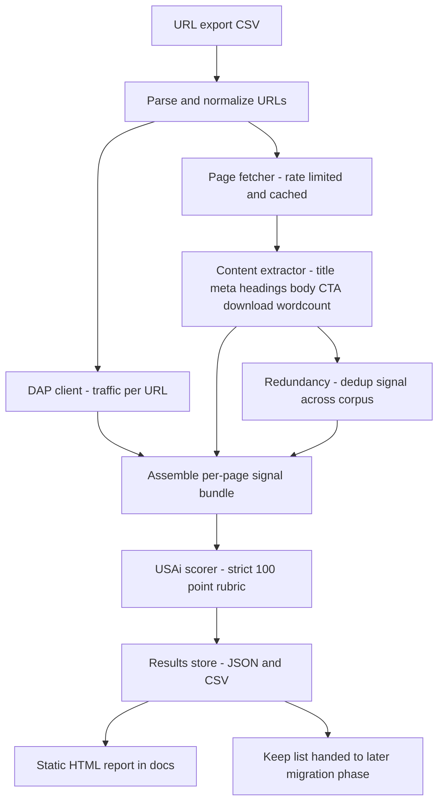

# Content Relevancy Audit & Scoring — Implementation Plan

> **Project:** GSA.GOV Website | **Owner:** Alison Childs | **Impact:** FIPS Low (public data only)
> **Status:** Implemented — full corpus scored 2026-08-17
> **Related ADR:** [ADR-006](../docs/decisions/ADR-006-content-relevancy-audit.md) · **Runbook:** [`scripts/content-audit/README.md`](../scripts/content-audit/README.md)

---

## 0. Post-implementation revisions

- **DAP → GA4 export.** The public DAP API does not expose per-URL traffic for
  the full corpus; traffic now comes from a GA4 "All Pages" CSV export
  (`data/All_Pages.csv`, exact host+path match). See ADR-006.
- **Newsroom preservation → distinct `Archive` bucket (2026-08-17).** The
  newsroom hard gate now reclassifies non-legal-hold press/newsroom pages to a
  new **Archive** recommendation instead of forcing Keep, so the Keep count
  reflects only genuinely-retained live content. Final tally (5,331): Keep
  1,391 · Consolidate 802 · Archive 1,853 · Delete 727 · Needs review 558
  (Legal hold 266 · Possible legal 1,083). Legal-hold newsroom pages stay Keep.
- **GitHub Pages.** The report/guide/JSON/CSV are published as a public
  browsable site via `.github/workflows/pages.yml` (public data only).

---

## 1. Goal

Score the ~5,000 pages of the existing GSA.GOV site against a weighted
100-point relevancy rubric, produce a reviewable report, and hand off a
"Keep" list for a later, separate content-migration phase.

**Explicitly out of scope for this phase:** migrating any content into
Payload. Migration is a follow-on effort that begins only after the owner
reviews the audit results.

---

## 2. Confirmed Decisions

| Decision       | Choice                                                                                                                                                          |
| -------------- | --------------------------------------------------------------------------------------------------------------------------------------------------------------- |
| Scoring model  | Weighted 100-point rubric (below), applied by an LLM with deterministic signals injected                                                                        |
| LLM provider   | **USAi** (GSA-approved) via API key                                                                                                                             |
| Traffic data   | **DAP** (`https://open.gsa.gov/api/dap/`) via API key                                                                                                           |
| Input data     | URL list (plus maybe titles) — full page content is fetched live via a crawler step                                                                             |
| Run sequencing | **Validation batch first (~100 representative URLs)**, owner reviews, then scale to all 5,000                                                                   |
| Deliverables   | **Static HTML report in `docs/`** (sortable/filterable table + per-page cards) **PLUS raw JSON and CSV artifacts** for spreadsheet re-sorting                   |
| Migration      | Separate later phase, gated on owner review of the Keep list                                                                                                    |
| Fetch mode     | **Static HTML only** — thin / JS-rendered / errored pages flagged `needsManualReview`, never auto-deleted on missing content alone                              |
| Legal hold     | **Statutorily-required pages force-Keep** and are excluded from Delete/Consolidate; unknown ones surfaced via a `possibleLegalHold` flag for human confirmation |

---

## 3. Scoring Rubric (total = 100 points)

| Criterion                        | Points | What earns points                                                                                                                                                                                                     |
| -------------------------------- | ------ | --------------------------------------------------------------------------------------------------------------------------------------------------------------------------------------------------------------------- |
| Alignment with lines of business | 30     | Clearly supports one of the three lines of business, general public info, or federal-employee info. Full points only if purpose is obvious and on-mission. Heavy deductions for off-topic, vague, or link-farm pages. |
| Content quality and depth        | 20     | Accurate, substantive, well-organized vs. thin, outdated, poorly written, filler.                                                                                                                                     |
| Actionable content               | 20     | Clear next step, form, checklist, contact, download, or decision. Descriptive-only pages score low.                                                                                                                   |
| SEO value                        | 15     | Ranks for meaningful keywords, useful backlinks, unique content. Link farms / near-duplicates near zero.                                                                                                              |
| Redundancy                       | 10     | Uniqueness. If equal/better info exists elsewhere on the site, score low.                                                                                                                                             |
| User value from traffic data     | 5      | High recent traffic/engagement (from DAP) = higher. Zero/near-zero = 0–1.                                                                                                                                             |

**Scoring posture:** consistent and strict. Most old-site pages are expected to
score low. High scores only when clearly earned.

### Strict output format per page

```
Page URL / Title:
Total Score: XX / 100
Breakdown:
Alignment: X/30
Content quality: X/20
Actionable: X/20
SEO value: X/15
Redundancy: X/10
User value: X/5

Recommendation: Keep / Consolidate / Delete
One-sentence justification:
Suggested action if Consolidate: (what it should be merged into or how it should be rewritten)
```

---

## 4. Architecture / Pipeline



### Deterministic signals fed INTO the LLM (to keep scoring grounded and cheaper)

- Word count, heading structure, presence of forms / downloads / contact info / CTAs (feeds Actionable + Content quality).
- Meta title/description presence, canonical, near-duplicate hash cluster size (feeds SEO + Redundancy).
- DAP traffic/engagement numbers for the URL (feeds User value).
- Keyword/mission matches derived from the site's own nav + wayfinder data (feeds Alignment).

---

## 5. Proposed File Layout

```
scripts/content-audit/
  config.ts            # thresholds, batch size, rate limits, model name
  types.ts             # PageInput, SignalBundle, ScoredPage
  run.ts               # resume-safe harness (checkpoint + cache + rate limit)
  parseUrls.ts         # URL export parser + normalizer
  dapClient.ts         # DAP traffic fetch + cache
  fetchPage.ts         # rate-limited, cached HTML fetch
  extractContent.ts    # readable content + CTA/form/download detection
  redundancy.ts        # corpus-wide dedup / similarity clustering
  scorer.ts            # USAi call, strict rubric, Keep/Consolidate/Delete
  report.ts            # JSON + CSV writer, static HTML generator
  .cache/              # gitignored fetch + DAP + score cache
docs/
  content-audit-report.html   # committed report
  content-audit-results.json  # committed raw scores (public data)
  content-audit-results.csv    # committed raw scores for spreadsheets
docs/decisions/
  ADR-006-content-relevancy-audit.md
```

---

## 6. Compliance & Guardrails (per AGENTS.md)

- **Dependency approval gate:** New deps (HTML fetch, Readability/DOM parser, CSV parser, USAi client) require owner approval before `npm install`. ADR-006 authored first.
- **Secrets:** `USAI_API_KEY` and `DAP_API_KEY` added to `.env.example` only. Real keys live in local `.env` (gitignored). Never committed, never logged.
- **Version pinning:** exact versions in `package.json`; run `npm audit`; verify no typosquatting; MIT/Apache/BSD only.
- **Locked region:** `SiteHeader.tsx` is untouched — this work does not modify it.
- **Modular architecture:** No changes to `src/blocks/`, `src/templates/`, `src/collections/`, or access control in this phase.
- **Meta-constraint:** >3 files changed → plan approved (this doc). PR includes Context, Plan, Verification, Rollback, Security Impact sections.
- **TDD:** unit tests for `parseUrls`, `extractContent`, `redundancy`, and scorer output-parsing (`src/lib`-style coverage, 80% on new logic).
- **Network:** only npmjs.com, USAi endpoint, DAP endpoint, and gsa.gov page fetches (TLS 1.2+); respect crawl politeness / rate limits.

---

## 7. Execution Order (todo list)

1. Confirm inputs: URL export file + columns; USAi base URL + model; DAP + USAi keys in local `.env`.
2. Author ADR-006.
3. Approval gate → install pinned deps → `npm audit`.
4. Add `USAI_API_KEY` + `DAP_API_KEY` to `.env.example`.
5. Scaffold `scripts/content-audit/` harness (cache + rate limit + checkpoint).
6. URL parser/normalizer (+ tests).
7. DAP client with caching.
8. Page fetcher + content extractor (+ tests).
9. Corpus redundancy signal (+ tests).
10. USAi scorer producing strict rubric output (+ output-parse tests).
11. Persist JSON + CSV.
12. Static HTML report generator.
13. **Validation batch ~100 → STOP for owner review.**
14. Incorporate feedback → run full 5,000 with resume-on-failure.
15. Summarize + hand off Keep list to later migration phase.
16. Submit PR (Context / Plan / Verification / Rollback / Security Impact).

---

## 8. Inputs Needed From Owner Before Coding Starts

- Path to the URL export file and its column names.
- USAi base URL + model identifier to target.
- Confirmation that `USAI_API_KEY` and `DAP_API_KEY` are set in local `.env`.
- Confirmation of the three "lines of business" wording so Alignment scoring matches official mission language.
