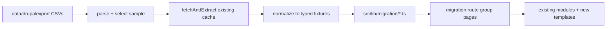

# Drupal Export → New Design Showcase

**Status:** proposed
**Owner:** Alison Childs
**Scope:** stand up a representative sampling of real legacy GSA.gov content in the new design, using established modules plus a small set of new templates, without modifying any existing prototype page or the global chrome.

---

## 1. Hard constraint: do not touch the existing prototype

The following are **read-only** for this work:

- `src/components/layout/**` — masthead (`SiteHeaderSideBySide`, `SiteHeader`, `MicrositeHeader`), nav (`MainNav`, `TopbarMegaMenu`, `MobileMenu`), ticker (`LiveTicker`), footer (`SiteFooter`), `StickyChrome`
- every existing `src/app/(frontend)/**`, `src/app/(category)/**`, `src/app/(preview)/**`, `src/app/(search)/**` route
- every existing file in `src/templates/**` and `src/components/modules/**`

All new work lands in a **new route group** `src/app/(migration)/`, which gets its own `layout.tsx` that _composes_ the existing chrome components by import only. Existing templates/modules are consumed as-is; where their prop shape does not fit a legacy content type, a **new** template is added alongside rather than editing the old one.

Verification: the implementation PR diff must show zero changed lines under `src/components/layout/`, `src/app/(frontend)/`, `src/app/(category)/`, and zero changed lines in pre-existing files under `src/templates/`.

---

## 2. What the export actually contains

`data/drupalexport/` (gitignored) holds 11 CSVs that are **metadata-only** — there is no body HTML in them.

| File                             | Drupal type          | Rows (approx) | Notable columns beyond the common set              |
| -------------------------------- | -------------------- | ------------- | -------------------------------------------------- |
| `Blogs.csv`                      | `blog_article`       | ~400          | Organization, Status                               |
| `topic pages.csv`                | `cmp_page`           | ~3,460        | POC, Author, Breadcrumb URL, Left Navigation Title |
| `news products.csv`              | `news_product`       | ~1,900        | POC, Author, Breadcrumb URL, Left Navigation Title |
| `events.csv`                     | `event`              | ~570          | Author, Organization                               |
| `directives.csv`                 | `directive`          | ~1,375        | Directive Status, Number, POC                      |
| `forms.csv`                      | `gsa_forms_library`  | ~1,240        | Form Status                                        |
| `technical procedures.csv`       | `technical_document` | ~490          | Organization (PBS)                                 |
| `photo albums.csv`               | `photo_album`        | ~240          | Author, Breadcrumb URL                             |
| `reusable text blocks.csv`       | `text_block`         | ~945          | POC, Author                                        |
| `file assets.csv`                | file assets          | —             | —                                                  |
| `searchExport-6a875cd5d331d.csv` | all types            | ~26,530       | master export                                      |

Common columns everywhere: `Title, Content-Type, CMP URL, Public URL, Node ID, Last Modified`.

**Implication:** the `Public URL` column is the join key to real content. Body copy must be fetched.

## 3. The content pipeline already exists

[`fetchAndExtract()`](scripts/content-audit/fetchPage.ts:93) already does exactly what is needed: politeness-delayed fetch, Readability extraction to clean text, `h1/h2/h3` capture, meta title/description/canonical, download-link detection, and a JSON cache under `scripts/content-audit/.cache/page/`. The cache is already warm with real GSA.gov body copy.

So we do **not** write a new scraper. We add a new, small entry point that:

1. parses the Drupal CSVs (reusing [`normalizeUrl()`](scripts/content-audit/parseUrls.ts:16)),
2. selects the sample,
3. calls the existing `fetchAndExtract` for each selected `Public URL`,
4. emits a typed TypeScript fixture module the new pages import.

Network approval: granted by the owner for `www.gsa.gov` via the existing fetcher only.

---

## 4. Sampling strategy

Target ~20–24 pages: enough to prove every template and every major module, small enough to hand-curate quality. Selection rules per type:

- **Recency bias** — prefer the newest `Last Modified` so the demo does not showcase stale copy.
- **Org spread** — include FAS, PBS, and OGP/staff-office items so the demo is not one-service-line heavy.
- **Substance filter** — drop anything the fetcher scores under the `thinContentWordThreshold` of 120 words.
- **Image availability** — pair each page with an existing asset from `src/assets/images/**` (REAL ESTATE, TECH, ACCOUNTABILITY, NEWS, 1800F, LEADERSHIP) since the export carries no media.

Proposed per-type counts: 4 `news_product`, 3 `blog_article`, 4 `cmp_page` (topic), 3 `event`, 2 `directive`, 2 `gsa_forms_library`, 1 `technical_document`, 2 `photo_album`, 1 `text_block` demo (rendered as a reusable insert on another page).

---

## 5. Template gap analysis

| Drupal type                | Existing template                                                                              | Fit     | Action                                                                       |
| -------------------------- | ---------------------------------------------------------------------------------------------- | ------- | ---------------------------------------------------------------------------- |
| `news_product`             | [`DetailPage`](src/templates/DetailPage.tsx:51)                                                | good    | reuse as-is                                                                  |
| `blog_article`             | [`DetailPage`](src/templates/DetailPage.tsx:51) / [`StoryPage`](src/templates/StoryPage.tsx:1) | good    | reuse as-is                                                                  |
| `cmp_page` (topic)         | [`TopicPage`](src/templates/TopicPage.tsx:59), [`InfoPage`](src/templates/InfoPage.tsx:35)     | good    | reuse as-is                                                                  |
| `photo_album`              | `ArticleGallery` + `DetailPage`                                                                | partial | new `GalleryPage` template wrapping existing gallery UI                      |
| `directive`                | none                                                                                           | **gap** | new `DirectivePage` — number, status, POC, effective date, PDF download      |
| `gsa_forms_library`        | none                                                                                           | **gap** | new `FormPage` — form number, revision date, status, download/fillable links |
| `event`                    | none                                                                                           | **gap** | new `EventPage` — date/time, location, registration CTA, agenda              |
| `technical_document`       | [`InfoPage`](src/templates/InfoPage.tsx:35)                                                    | partial | reuse `InfoPage`; add a `DocumentMeta` module for version/applies-to         |
| `text_block`               | none                                                                                           | n/a     | new `ReusableTextBlock` module, embeddable in other templates                |
| directives/forms **index** | [`DataPage`](src/templates/DataPage.tsx:26)                                                    | good    | reuse for filterable listings                                                |

New modules implied: `DocumentMeta`, `DownloadPanel`, `EventDetailsCard`, `ReusableTextBlock`, `LegacyBreadcrumbTrail` (the export's `Breadcrumb URL` column is worth surfacing).

---

## 6. CMS parity

Every new template and module must ship a matching Payload block so editorial staff get it in the CMS, following the existing pattern in [`ImagePanelBlock`](src/blocks/ImagePanelBlock.ts:16) and registration in [`Pages`](src/collections/Pages.ts:57). New collections for the legacy types (`Directives`, `Forms`, `Events`) are an **ADR trigger** per `AGENTS.md` (changing the CMS content model) — so blocks first, collections only after an ADR.

---

## 7. Design styling for new modules

New modules inherit the established token vocabulary already visible in the templates: `bg-usds-steel-50/100/200`, `text-usds-steel-600/900`, `bg-gsa-navy`, `focus-visible:ring-gsa-blue`, `font-garamond` display type, the `text-[12px] font-semibold tracking-[0.14em] uppercase` eyebrow, `max-w-[600px]` article measure, and `max-w-7xl` page measure. No new color or type primitives without an entry in `src/lib/tokens/colors.ts`.

---

## 8. Index / showcase page

A single `/migration` landing page acts as the demo index: a table of the sampled pages grouped by legacy content type, each row showing the legacy title, node ID, source URL, the new template used, and a link to the rendered page. This is what gets walked through in review.

---

## 9. Risks

- **Fetch failures / 404s on legacy URLs** — the fetcher already flags `not-found-404` and `fetch-error`; drop those rows from the sample rather than fabricating copy.
- **Copy accuracy** — extracted text is real GSA copy; the fixture generator must not paraphrase. Any editorial trimming is truncation only, and the source URL is recorded on every fixture.
- **No PII** — legacy pages contain POC names/emails. Per `AGENTS.md` these are public-role contacts, but the fixture generator must strip anything that looks like a personal phone or non-`.gov` email.
- **Static export** — `scripts/build-static.mjs` exists; new dynamic routes must be statically enumerable via `generateStaticParams`.
